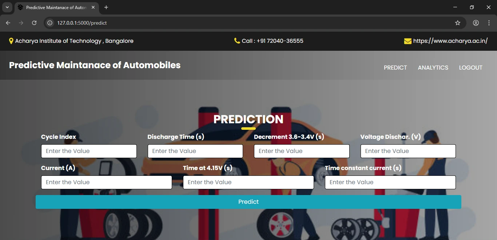

<link rel="stylesheet" href="https://cdnjs.cloudflare.com/ajax/libs/font-awesome/6.5.0/css/all.min.css">

# 🚗 Predictive Maintenance for Automobiles — IoT + ML

<p align="center">
  <strong>Intelligent vehicle health monitoring using IoT sensors, embedded systems, and machine learning.</strong><br>
  <a href="#features">Features</a> • <a href="#architecture">Architecture</a> • <a href="#getting-started">Getting Started</a>
</p>

<p align="center">
  
  
  
  
</p>

---

## 🧭 Project Overview

Predictive Maintenance for Automobiles combines **ESP32-based sensor telemetry**, **embedded firmware**, a **Flask** web dashboard, and a **Random Forest** ML model to predict vehicle faults, battery degradation, and remaining useful life (RUL). The system supports local alerts (LCD + buzzer) and remote alerts via a Telegram bot. :contentReference[oaicite:5]{index=5}

---

## 🚀 Key Features

- <i class="fa-solid fa-broadcast-tower"></i> **Real-time telemetry** from ESP32 sensors  
- <i class="fa-solid fa-robot"></i> **ML-based predictions** (Random Forest) for faults & BMS (battery)  
- <i class="fa-solid fa-tv"></i> **Web dashboard** (Flask + Jinja2 + Bootstrap) with visualizations  
- <i class="fa-solid fa-bell"></i> **Dual notifications:** LCD + buzzer (local) and Telegram Bot (remote)  
- <i class="fa-solid fa-database"></i> **Data persistence:** SQLite for lightweight storage  
- <i class="fa-solid fa-microchip"></i> **Embedded stack:** Arduino (Embedded C), ESP32, Zigbee for mesh/wireless  

---

## 🏗️ Architecture & Components

### Hardware
- **ESP32** — IoT data collection & transmission  
- **Sensors:** DHT11 (temp/humidity), ADXL345 (accelerometer), Oil level sensor  
- **Power:** 12V lead-acid battery (target for BMS predictions)  
- **UI:** LCD + Buzzer for local alerts  
- **Comm:** Zigbee module (wireless), Telegram Bot for remote alerts

### Software
- **Embedded:** Arduino IDE (C/C++) for ESP32 firmware  
- **Backend:** Flask (Python) + Jinja2 templates  
- **Frontend:** HTML, Bootstrap, jQuery for UI and charts  
- **DB:** SQLite  
- **ML:** Random Forest (training in Jupyter / scikit-learn)  
- **Notifications:** Telegram Bot API

---

## 🧭 Machine Learning Model

- **Algorithm:** Random Forest (ensemble)  
- **Use cases:** Predict vehicle faults, battery degradation, and estimate RUL  
- **Typical input features:** Cycle index, discharge times, voltage/current readings, time-at-voltage, etc. :contentReference[oaicite:6]{index=6}

---

## 🖼️ Visuals & Diagrams

<p align="center">
  <br>
  <em>Figure — Web dashboard preview_1</em>
</p>

<p align="center">
  <br>
  <em>Figure — Web dashboard preview_2</em>
</p>

<p align="center">
  <br>
  <em>Figure — System block diagram</em>
</p>

<p align="center">
  <br>
  <em>Figure — Working Overview</em>
</p>

<p align="center">
  <br>
  <em>Figure — Data flow & alert flowchart</em>
</p>

<p align="center">
  <br>
  <em>Figure — Analytics and visualizations</em>
</p>

<p align="center">
  <br>
  <em>Figure — Analytics and visualizations</em>
</p>

<p align="center">
  <br>
  <em>Figure — Telegram bot alert</em>
</p>

---

## 🛠️ Getting Started

**Prereqs**
- Python 3.8+  
- Arduino IDE (for ESP32)  
- pip, virtualenv (recommended)  

**Install backend dependencies**
```bash
# from repo root
python -m venv .venv
source .venv/bin/activate        # Linux / macOS
# .venv\Scripts\activate         # Windows PowerShell

pip install -r requirements.txt
# or
pip install flask scikit-learn pandas jinja2 matplotlib sqlite3

export FLASK_APP=backend/app.py
export FLASK_ENV=development
flask run
# or on Windows:
# set FLASK_APP=backend\app.py
# flask run

